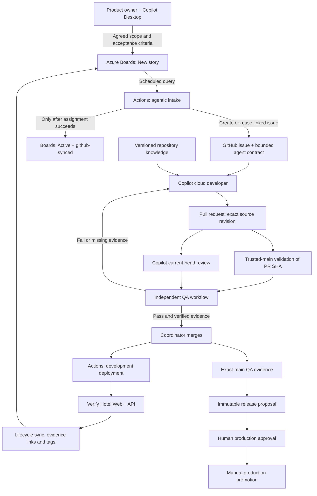
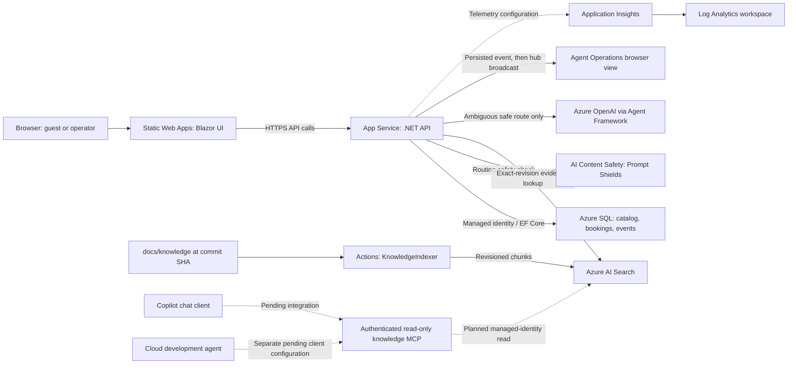
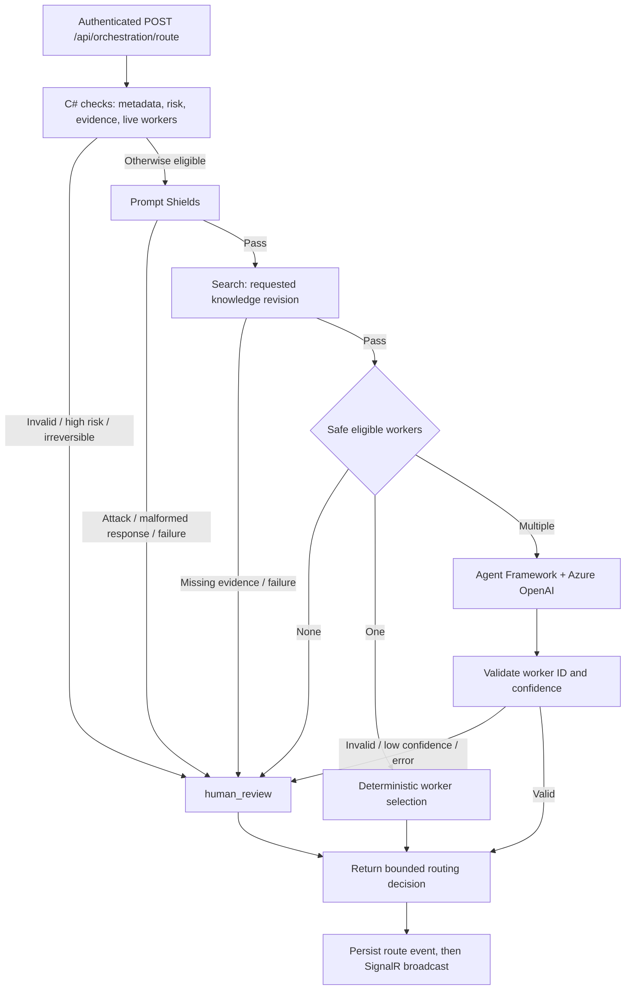

# Azure services and the agentic development harness

**Audience:** developers and architects. **Reviewed:** 2026-09-30.

**Source baseline:** `f48fe735ee7873e0f75a84034e3f12ef88108d16`, plus the agreed development-demo policy in the [delivery contract](../knowledge/agentic-delivery.md). These diagrams describe repository wiring, not proof that every optional integration has run.

The **harness** is the surrounding system that gives an agent its task, knowledge, permissions, checks, and evidence. It is not one Azure service or an unrestricted AI controller.

There are two separate paths:

- **Software delivery:** Azure Boards, GitHub Copilot, and GitHub Actions move an agreed requirement toward a verified development deployment.
- **Runtime routing:** the Hotel API applies C# policy, safety checks, and optional model selection to a routing request. Returning a worker ID does not start a GitHub coding agent.

## 1. Service responsibility map

| Service or component | Task / responsibility | Caller and boundary |
|---|---|---|
| Azure DevOps **Boards** | User Stories, Bugs, acceptance criteria, work state, and delivery links | Copilot captures agreed requirements; the Actions intake uses the Azure DevOps API. Boards is not the source-code host or build engine. |
| **Azure Static Web Apps** | Hosts the Blazor WebAssembly Hotel UI and Agent Operations page | The browser loads static files and calls the separately hosted API. No agent implementation runs in the web page. |
| **Azure App Service + App Service plan** | Runs the ASP.NET Core booking API, operations ingestion, SignalR hub, and routing endpoint | The plan provides compute; the API's system-assigned managed identity authenticates to Azure data/AI services. |
| **Azure SQL Database** | Persists hotels, rooms, reservations, and bounded operations-event history | EF Core uses the API identity and the restricted `hotel_booking_runtime` role. The deployment identity handles migrations; runtime is not a schema administrator. |
| **Azure AI Search** | Stores revisioned chunks of canonical Markdown; checks exact-revision grounding for runtime routing | The deployment indexer writes; the API reads. The current router checks for matching evidence, not a full chat answer. A provisioned index does not mean Copilot has an MCP connection. |
| **Azure AI Content Safety / Prompt Shields** | Detects prompt attacks in routing task metadata and live worker descriptions | Called by the API before worker selection. Detection, malformed responses, and service failure stop automatic routing. It is not a permission grant or a guarantee against hallucinations. |
| **Azure OpenAI in the Azure AI Services account** | Suggests a worker when several safe candidates remain | Microsoft Agent Framework calls the configured `gpt-4.1-mini` deployment. Only bounded routing metadata and worker IDs are sent; the model cannot add workers or authorize actions. |
| **Microsoft Entra ID** | Issues tokens, provides workload identity federation and managed identities, and enforces app roles | Actions uses OIDC federation; the API uses managed identity. Operations writers need the `Operations.Ingest` role outside the local/test Development mode. |
| **Azure RBAC** | Separates resource deployment, Search indexing, Search reading, and AI inference permissions | Roles are scoped to the relevant resources. SQL data access additionally uses contained database users and database grants, not just Azure RBAC. |
| **Application Insights** | Application telemetry destination for diagnosis and correlation | Bicep provisions a workspace-backed component and configures its connection string on the API. This configuration alone is not proof that every agent or workflow emits telemetry. |
| **Log Analytics** | Workspace backing Application Insights and log retention/querying | Operator diagnostics, not the authoritative source for work-item state or release approval. |
| **Azure Key Vault (legacy)** | Retains a historical SQL credential where an upgraded environment still has it | The current API is passwordless; current platform Bicep exposes the legacy vault name but does not create a new vault. Cleanup is separate, explicitly confirmed work, not an automatic demo step. |
| **Azure Resource Manager + Bicep** | Declares Azure resources, identity assignments, and environment outputs | GitHub Actions deploys through its federated identity. Development uses `agentic-hotelbookingdev`; production uses the separately scoped `agentic-hotelbookingprod`. |
| **Microsoft evaluation SDK** | Runs `GroundednessEvaluator` in the explicit cloud evaluation workflow | It runs on an Actions runner against configured Azure AI endpoints; it is not a continuously running hosted agent. Require a successful revision-bound artifact before claiming live evaluation. |

The runtime resources and role assignments are declared in [platform.bicep](../../infra/modules/platform.bicep). The [security contract](../knowledge/security.md) defines exact identity and SQL boundaries.

### What runs outside Azure hosting?

| Component | Responsibility |
|---|---|
| GitHub Copilot Desktop | Product discussion and requirement refinement; does not automatically mirror its conversation into Agent Operations. |
| GitHub Copilot cloud agent | Reads the work item and repository knowledge, implements a bounded change, tests in its cloud workspace, and opens a PR. |
| GitHub repository | Source, issues, branches, PRs, review history, and versioned knowledge. |
| GitHub Actions and artifacts | Intake, validation, review coordination, independent QA evidence, deployment, and release packages. Azure DevOps Pipelines is not used. |
| Microsoft Agent Framework | A .NET library used inside the API's router, not a separate Azure-hosted orchestration service controlling GitHub agents. |
| ASP.NET Core SignalR | A hub hosted inside the API. No separate Azure SignalR Service resource is declared in the current platform. |

## 2. Delivery harness: from requirement to development

**Development demo:** no additional human merge/release approval after required checks pass. The coordinator still verifies evidence; the diagram does not claim native auto-merge is configured. Explicit leave-unmerged instructions still apply.

**Evidence contract:** PR validation tests the requested SHA from a trusted workflow on `main`; Copilot review must match that head; QA binds the head plus PR title/body digest. Source changes invalidate affected evidence, and metadata changes invalidate the digest-bound QA result. Missing evidence means stop, not pass.

**Intake contract:** capture creates a `New` User Story without `github-synced`; the scheduler owns later assignment and `Active`. Five-minute cron is not a pickup SLA. Delivery synchronization adds evidence links and tags but does **not** automatically close a story.

**Execution contract:** implementation and application tests stay in cloud agents/runners. The user may explicitly permit local documentation work. Workflow-run approval is a separate GitHub repository setting and is not removed by development release authorization.

## 3. Azure runtime and knowledge paths

Solid edges show implemented repository paths. Dotted telemetry configuration is not proof of emitted events; dotted MCP paths are the separately implemented integration and must be demonstrated before being described as connected.

Repository knowledge remains authoritative. The indexer stores document path, revision, owner, review date, content, and deterministic chunk identity. A local edit/commit does not update the hosted index.

For the MCP milestone, demonstrate a **real chat tool call** returning passages with revision and citations, then a **separate cloud developer tool call**. The existing routing existence check is not either of those demonstrations.

Agent Operations reads the SQL-backed operations API and receives API-hosted SignalR updates. It does not automatically consume every Boards change, GitHub workflow, or Desktop conversation. Use GitHub Actions for delivery-run status and Boards for product state.

## 4. Runtime routing: policy controls the model

This path is implemented by [MicrosoftAgentRouter.cs](../../src/Infrastructure/MicrosoftAgentRouter.cs), [RoutingEvaluation.cs](../../src/Infrastructure/RoutingEvaluation.cs), and the route handler in [Program.cs](../../src/Api/Program.cs). The deployed evaluation configuration enables the safety/grounding gate; an explicitly disabled evaluation configuration is not proof of live Azure checks.

The API returns a decision and records it. It does not start the selected GitHub agent, approve a PR, or execute a production deployment. Authentication/authorization and model safety are separate controls.

## 5. Identity and failure boundaries

| Boundary | Identity / permission | Failure behavior |
|---|---|---|
| Actions to Azure | GitHub OIDC federation to the deployment service principal | Authentication or scoped permission failure stops deployment; no developer-local credential fallback. |
| Intake to GitHub | `COPILOT_AGENT_TOKEN` for supported Copilot assignment | Verify actual bot assignment before changing Boards state; no success-shaped placeholder. |
| Review workflow to PR | Scoped tokens; trusted review workflow never executes PR code | Missing current-head review or blocking findings prevent acceptance. |
| API to SQL | System-assigned managed identity and restricted database role | No SQL password fallback; migration/bootstrap belongs to deployment. |
| API to Search and AI | Entra managed identity with resource-specific roles; local keys disabled | Missing evidence, service errors, and invalid model results return `human_review`. |
| Operations writer to API | Entra token with matching audience and `Operations.Ingest` outside Development mode | Reject unauthorized writes. Public Hotel and operations-read endpoints have different policies. |
| Development to production | Separate environment, exact release artifact, explicit manual dispatch and confirmations | No automatic production deployment from merge or a green check. |

No service can by itself eliminate hallucinations. Revisioned retrieval, citations, bounded model input, deterministic validation, independent review, and explicit failure states work together. Private-plan branch/environment protection limitations are documented in the [pipeline overview](README.md); do not claim unavailable server-enforced controls.

## 6. Where a developer changes each part

| Change area | Source |
|---|---|
| Requirement intake and assignment | [agentic-intake.yml](../../.github/workflows/agentic-intake.yml), [Start-AgenticWork.ps1](../../scripts/Start-AgenticWork.ps1) |
| Agent task contracts | [agent profiles](../../.github/agents/), [AGENTS.md](../../AGENTS.md) |
| Validation and review | [pr-validation.yml](../../.github/workflows/pr-validation.yml), [hotel-code-review.yml](../../.github/workflows/hotel-code-review.yml) |
| Independent evidence and lifecycle updates | [qa-evidence.yml](../../.github/workflows/qa-evidence.yml), [sync-development-lifecycle.yml](../../.github/workflows/sync-development-lifecycle.yml) |
| Development deployment | [deploy-development.yml](../../.github/workflows/deploy-development.yml) |
| Production packaging and promotion | [release-proposal.yml](../../.github/workflows/release-proposal.yml), [deploy-production.yml](../../.github/workflows/deploy-production.yml) |
| Azure resources and role assignments | [resource-group.bicep](../../infra/resource-group.bicep), [platform.bicep](../../infra/modules/platform.bicep) |
| Knowledge source and projection | [knowledge center](../knowledge/README.md), [KnowledgeIndexer](../../tools/KnowledgeIndexer/), [KnowledgeIndexing.cs](../../src/Infrastructure/KnowledgeIndexing.cs) |
| Explicit groundedness evaluation | [grounded-evaluation.yml](../../.github/workflows/grounded-evaluation.yml) |

For the product-owner story, use the [short demo](../../demo/TEAM-DEMO-GUIDE.md); for exact policy, use the [canonical delivery](../knowledge/agentic-delivery.md), [architecture](../knowledge/architecture.md), and [security](../knowledge/security.md) documents.
