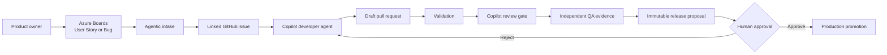
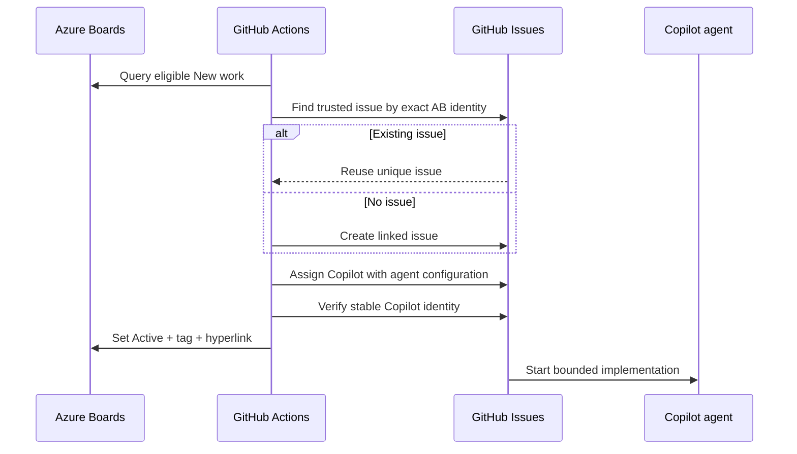
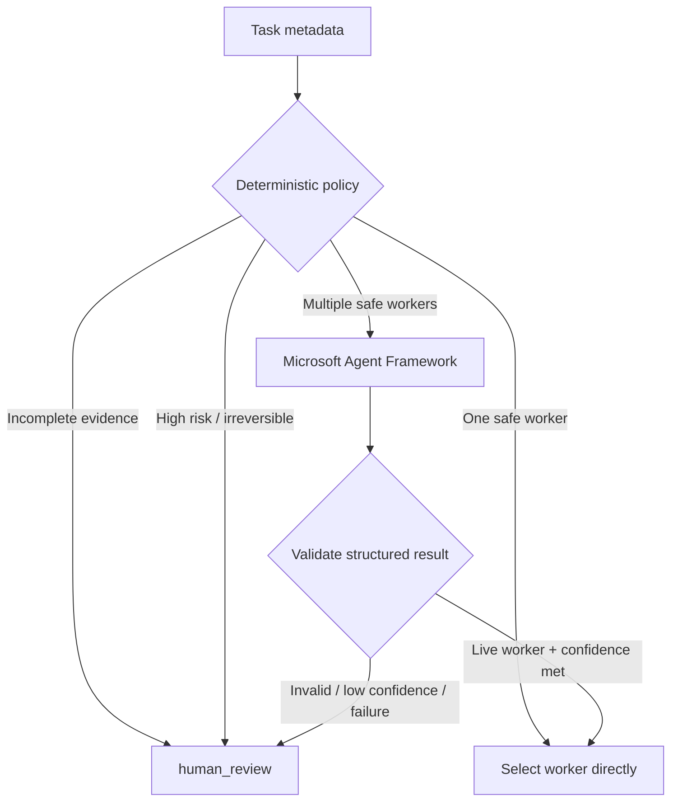
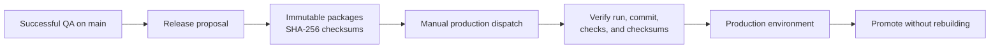

# Agentic Development

## From product intent to governed delivery

**Audience:** architects, developers, product owners, and DevOps engineers  
**Format:** 35-45 minutes plus discussion  
**Repository knowledge revision:** `7e6c3b15bdd28fdc142ae0960df009de5d0c8088`

<!--
Speaker notes:
Set the expectation: this is not a generic AI vision. It is a walkthrough of an implemented delivery system, the controls around it, and the decisions the group still owns.
-->

---

# The short version: What, Why, How

| Question | Answer |
|---|---|
| **What?** | A governed software-delivery flow in which agents can implement bounded work while people retain product and release authority. |
| **Why?** | To shorten feedback loops without trading away traceability, quality, security, or operational control. |
| **How?** | Azure Boards + GitHub + Copilot agents + deterministic policy + evidence gates + Azure identity and observability. |

> The goal is not maximum autonomy. The goal is **useful autonomy inside explicit boundaries**.

<!--
Speaker notes:
Use this slide to align vocabulary. "Agentic" means software can choose and perform bounded next steps. It does not mean an AI receives unrestricted repository or production authority.
-->

---

# Why change the development model?

## The recurring friction

- Product intent is separated from implementation evidence.
- Work is repeatedly translated between planning, coding, testing, and release tools.
- Quality checks are often present but not connected to one immutable revision.
- Operational AI decisions can be hard to inspect after the fact.
- Faster code generation can amplify weak requirements and weak controls.

## The desired outcome

**One traceable chain:** requirement -> implementation -> review -> QA evidence -> release artifact -> approved deployment.

<!--
Speaker notes:
For product owners, emphasize continuity of intent. For developers, emphasize less context reconstruction. For architects and DevOps, emphasize immutable evidence and controlled identities.
-->

---

# Design principles

1. **The work item defines scope.**
2. **Versioned repository knowledge defines current rules.**
3. **Deterministic code owns authorization and safety gates.**
4. **Models choose only among live, pre-approved options.**
5. **No proof means no completion.**
6. **Irreversible actions remain human-controlled.**
7. **Failure is explicit and recoverable, not success-shaped.**

<!--
Speaker notes:
These principles are the common contract across product, engineering, architecture, and operations. They are more important than any individual model or tool.
-->

---

# End-to-end development flow

**Implemented:** intake, development, validation, review, QA evidence, release proposal, development deployment, and manual production promotion.

<!--
Speaker notes:
Walk left to right. Each transition has a machine-verifiable contract. Production is deliberately not the automatic result of a green build.
-->

---

# Who owns what?

| Concern | System of record |
|---|---|
| Product scope, priority, and work state | Azure Boards |
| Code, issues, pull requests, checks, artifacts | GitHub |
| Bounded implementation and review assistance | GitHub Copilot |
| Workflow orchestration and evidence collection | GitHub Actions |
| Product/domain/architecture/security rules | `docs/knowledge/` and ADRs |
| Runtime, identity, data, AI, and monitoring | Azure |
| Production authorization | Human operator + protected workflow |

**Important:** An agent can do work; it does not become the owner of the decision.

<!--
Speaker notes:
This slide is useful when ownership questions arise. Keep Azure Boards for product work and GitHub for code-delivery evidence rather than forcing one tool to do both jobs.
-->

---

# Grounding: how agents know what is true

## Source order

1. Accepted Azure Boards work item
2. `docs/knowledge/`
3. `docs/adr/`
4. Code and executable tests

## Required behavior

- Record the Git commit used as the knowledge revision.
- Cite repository-relative sources for material claims.
- Label conclusions as sourced, derived, or assumed.
- Stop when sources conflict or are incomplete.
- Update canonical knowledge with behavior or architecture changes.

> Chat history and model memory are not authoritative.

<!--
Speaker notes:
Explain this as configuration management for reasoning. The model is replaceable; the repository revision is reviewable and reproducible.
-->

---

# Intake: Azure Boards to Copilot

**Recovery:** manual dispatch accepts one work-item ID and only `New` or `Active` state.

<!--
Speaker notes:
The order matters. Azure Boards is changed only after GitHub confirms the agent assignment. A retry finds and reuses the original issue.
-->

---

# Intake safety and idempotency

## Duplicate prevention

- `AB#<id>` plus the exact canonical Azure Boards link is the idempotency key.
- Existing issues must come from an owner, member, or collaborator.
- Multiple matches fail closed.
- Existing assignees are preserved during repair.
- Azure Boards revision tests prevent concurrent overwrite.

## Token semantics

- Copilot assignment uses a GitHub **user token**.
- The workflow `GITHUB_TOKEN` is not treated as equivalent.
- Copilot is recognized through its stable bot identity and documented login projections.

<!--
Speaker notes:
This is a useful technical discussion point: idempotency is a business identity problem, not merely a retry setting. Trusted author association prevents an attacker from pre-claiming a Board identity.
-->

---

# Real proof: AB#959

**Requirement:** show total stay price before booking confirmation.

| Evidence | Result |
|---|---|
| Azure Boards | Item moved to `Active`, tagged `github-synced`, and linked to GitHub |
| GitHub intake | Existing issue #5 was reused; no duplicate was created |
| Agent identity | Copilot assignment was verified |
| Development | Copilot created the implementation pull request |
| Validation | Restore, format, build, tests, and Bicep passed |
| Delivery | Change merged and development deployment succeeded |

**Lesson:** the first run exposed a response-identity mismatch; the recovery path resumed the real issue instead of starting over.

<!--
Speaker notes:
This is the concrete story behind the architecture. The implementation was improved because a real partial failure was observed and recovered, not because a happy-path demo was scripted.
-->

---

# Agent roles are bounded

## Developer agent

- Implements one vertical slice.
- Reads the operating contract and canonical knowledge.
- Adds tests and preserves security/architecture rules.
- Opens a pull request with evidence.

## QA role

- Rechecks acceptance criteria and negative paths.
- Does not accept developer claims without evidence.
- Reports passed, failed, or unverified.

## Current platform constraint

GitHub has no supported PR-check API to dispatch the repository's custom QA agent. The workflow enforces its evidence contract but records custom-agent execution as `not-run`.

<!--
Speaker notes:
Be precise: do not claim an agent ran when the platform cannot prove it. The automated QA gate is real; the custom QA-agent invocation remains a separate manual option.
-->

---

# Routing: deterministic first, model second

**The model may choose from a safe menu. It cannot create permissions, approve risk, or bypass policy.**

<!--
Speaker notes:
For architects: the model is an advisory component inside a deterministic control plane. For product owners: uncertainty routes to a person rather than silently guessing.
-->

---

# What the model can see

## Sent to model-assisted routing

- Task category
- Required capability
- Risk level
- Evidence state
- Live worker IDs

## Not sent

- Source code
- Prompts or retrieved document bodies
- Secrets or credentials
- Guest or personal data
- Full work-item descriptions

Azure OpenAI is accessed with App Service managed identity. Invalid output, low confidence, missing configuration, service failure, or elevated risk routes to `human_review`.

<!--
Speaker notes:
This is data minimization. It reduces leakage risk and also improves routing consistency because the model receives only the fields required for the decision.
-->

---

# Pull-request quality gates

## PR validation

1. Locked dependency restore
2. Intake regression harness
3. Formatting verification
4. Full build
5. Unit and integration tests
6. Bicep compilation

## Copilot review

- Review is tied to the current head commit.
- Unresolved High or unclassified findings block.
- Resolved findings trigger re-evaluation.
- Privileged workflow does not execute pull-request code.

> A green check is evidence for an exact revision, not a general statement about a branch.

<!--
Speaker notes:
Explain why head-SHA binding matters: an approval or test result for an older commit must not silently authorize newer code.
-->

---

# Secure validation of Copilot-authored PRs

GitHub may intentionally mark a Copilot PR run `action_required` before jobs start.

## Supported paths

- Maintainer approves the run from the merge box, or
- Maintainer manually dispatches validation with:
  - pull-request number;
  - exact 40-character head SHA.

## Guardrails

- Verify repository and `main` base.
- Verify the live PR still has the supplied SHA.
- Reject stale SHA requests.
- Never use `pull_request_target` to execute untrusted PR code.

<!--
Speaker notes:
The AB#959 implementation proved both outcomes: a stale SHA was rejected, and the live final SHA passed the complete validation suite.
-->

---

# Independent QA evidence

The QA workflow:

- resolves the immutable pull-request head;
- rejects a changed head;
- waits for PR validation and review evidence;
- independently rebuilds and reruns tests;
- compiles Bicep;
- checks acceptance-criteria and negative-path evidence;
- records the cited knowledge revision;
- uploads JSON, Markdown, and TRX evidence.

**Trust boundary:** the evidence-policy script comes from the default branch, so pull-request code cannot weaken its own gate.

<!--
Speaker notes:
This is separation of duties implemented as code provenance. The candidate change can be tested, but it does not supply the policy that decides whether its evidence is sufficient.
-->

---

# Release is packaging; deployment is authorization

- Pushes and green checks cannot deploy production.
- Operator supplies the exact release run, commit SHA, and `DEPLOY-PRODUCTION`.
- Production promotes verified binaries; it does not rebuild different binaries.

<!--
Speaker notes:
This is a key DevOps distinction. Build once, verify, then promote the same bytes. Typed confirmation is one control, not the only control.
-->

---

# Azure runtime topology

| Capability | Azure service |
|---|---|
| Booking web | Static Web Apps |
| Booking and operations API | App Service |
| Catalog, reservations, operations events | Azure SQL |
| Secrets | Key Vault |
| Model-assisted routing | Azure AI Services / Azure OpenAI |
| Revisioned knowledge retrieval | Azure AI Search |
| Telemetry | Application Insights + Log Analytics |

**Identity:** GitHub Actions uses OIDC; App Service uses managed identity; operations writers use Entra application roles.

<!--
Speaker notes:
The architecture deliberately avoids stored Azure client secrets for workflows and avoids model API keys in the application.
-->

---

# Observability: agents are operational workloads

The operations event stream records:

- routing decision and confidence;
- policy or model identifier;
- selected and effective worker;
- agent/tool activity;
- evidence and completion state;
- failures and latency;
- approval checkpoints;
- work-item correlation and knowledge revision.

Events are persisted before SignalR broadcast. Retention and query sizes are bounded.

**Excluded:** prompts, source code, tokens, credentials, personal data, and tool-output bodies.

<!--
Speaker notes:
Treat agent behavior like any distributed system: correlate decisions, measure failures, and retain enough metadata to investigate without copying sensitive payloads into telemetry.
-->

---

# Security model in one slide

| Risk | Implemented control |
|---|---|
| Forged work-item linkage | Canonical URL + trusted issue author association |
| Duplicate dispatch | AB identity + unique match + Board revision test |
| Over-privileged model | Deterministic policy owns permissions and gates |
| Secret exposure | OIDC, managed identity, Key Vault references |
| Prompt/data leakage | Minimal routing metadata; sensitive bodies excluded |
| Untrusted PR execution | Exact-SHA validation; trusted policy checkout |
| Silent quality failure | Fail-closed checks and explicit `unverified` states |
| Unapproved production change | Manual exact-artifact promotion |

<!--
Speaker notes:
Invite the security architect to challenge the trust boundaries. The system should be evaluated as identities, data flows, and authorization points—not as a single "AI agent."
-->

---

# Deliberate tradeoffs and constraints

- **Private repository plan:** branch protection, rulesets, environment reviewers, and wait timers are not available; workflows compensate but cannot claim server-enforced protection.
- **QA agent API gap:** evidence contract is automated; custom QA-agent execution is not falsely claimed.
- **Copilot run approval:** remains a repository security choice; exact-SHA fallback supports controlled recovery.
- **Production:** implemented as manual-only, but no production deployment was performed while building the pipeline.
- **Model routing:** improves ambiguous safe choices; deterministic fallback remains authoritative.

<!--
Speaker notes:
This is where architects and DevOps should decide whether plan upgrades or additional platform controls are worth the cost. Do not hide product limitations behind workflow language.
-->

---

# What success looks like

## Product owner

- Requirement and acceptance criteria remain visible end to end.
- Work can be resumed after partial failure without duplicate work.

## Developer

- Agent receives bounded context and produces reviewable code and tests.
- Quality feedback is tied to the exact commit.

## Architect

- Decisions, trust boundaries, identities, and fallbacks are explicit.

## DevOps

- Builds are reproducible, artifacts are immutable, and production is promoted—not rebuilt.

<!--
Speaker notes:
Ask each audience group whether these are the right success measures. This turns the presentation into a design review rather than a one-way demo.
-->

---

# Decisions for this group

1. Should we upgrade the repository plan to enforce required checks and environment reviewers?
2. Which Azure Boards state should follow a merged and deployed change?
3. What evidence is mandatory before a product owner accepts a story?
4. When is model-assisted routing valuable enough to justify the extra dependency?
5. Which operations events need alerts or service-level objectives?
6. Who owns production approval and rollback decisions?
7. Where should custom-agent judgment remain manual?

<!--
Speaker notes:
Pause here. Assign an owner and a follow-up artifact for each accepted decision. Avoid resolving policy questions only in meeting notes; capture decisions in knowledge or ADRs.
-->

---

# Recommended next increments

## Near term

- Synchronize merged/released evidence back to Azure Boards.
- Remove lifecycle tags such as `ready-for-triage` when state advances.
- Define alerting for failed routing, intake, QA, and deployment.
- Prepare for GitHub Actions Node runtime and Ubuntu runner changes.

## Governance

- Decide on repository-plan controls.
- Define production approvers and rollback evidence.
- Add ADRs for material policy changes.

## Measurement

- Lead time from accepted work to draft PR
- Retry/recovery rate
- Review findings by severity
- QA rejection rate
- Human-review routing rate
- Deployment and rollback outcomes

<!--
Speaker notes:
These are recommendations, not claims of current implementation. Prioritize lifecycle closure and measurable outcomes before expanding agent autonomy.
-->

---

# Discussion

## What should remain human?

## What can become deterministic?

## Where does model judgment add value?

## Which evidence would make you trust the next step?

<!--
Speaker notes:
Use these four questions to structure the remaining meeting. Keep the discussion anchored to a concrete transition in the delivery flow.
-->

---

# Appendix: shared vocabulary

| Term | Plain-language meaning |
|---|---|
| Agent | Software that can choose and perform bounded actions |
| Deterministic policy | Rules in code with predictable outputs |
| Grounding | Giving the agent versioned, authoritative context |
| Idempotent | Safe to retry without creating duplicate effects |
| Evidence gate | A check requiring proof before progress |
| Head SHA | Exact Git commit currently proposed by a PR |
| OIDC | Short-lived identity exchange without a stored Azure client secret |
| Managed identity | Azure-managed workload identity |
| Promotion | Deploying already-built, verified artifacts |

---

# Appendix: source map

- `docs/development-pipeline/README.md` - implemented end-to-end process
- `docs/knowledge/agentic-delivery.md` - routing, autonomy, and evidence rules
- `docs/knowledge/architecture.md` - runtime and agent architecture
- `docs/knowledge/security.md` - identity, data, and action controls
- `docs/adr/0001-agentic-delivery-platform.md` - platform decision
- `docs/adr/0002-microsoft-native-agent-routing.md` - routing decision
- `.github/workflows/` - executable delivery controls
- `scripts/Start-AgenticWork.ps1` - idempotent Azure Boards intake
- `src/Infrastructure/MicrosoftAgentRouter.cs` - deterministic/model routing

**Grounding:** content is sourced from repository revision `7e6c3b15bdd28fdc142ae0960df009de5d0c8088`.

