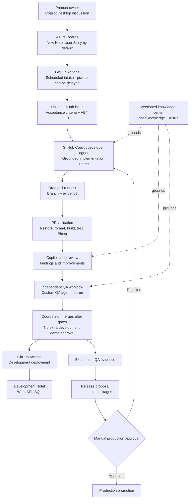

# Development Pipeline

This folder documents how the Hotel Booking system is developed, validated, observed, and deployed. Azure Boards provides product-work visibility, GitHub is the code and delivery system, GitHub Copilot agents perform bounded software work, and Azure hosts the development environment and Microsoft-native AI services.

For a nontechnical 5-10 minute walkthrough, use the [team demo guide](../../demo/TEAM-DEMO-GUIDE.md) or its [short showcase entry point](SHOWCASE.md).

For developers and architects, start with the [Azure service responsibilities and harness diagrams](AZURE-SERVICES-AND-HARNESS.md). The [technical presentation](PRESENTATION.md) is an optional deeper explanation.

## Development process



The intake, pull-request validation, Copilot review gate, independent QA evidence gate, development deployment, release proposal, manual production deployment, routing telemetry, and operations dashboard are implemented. Production release remains manual-only and cannot be triggered by a push or successful check.

The runtime C# routing API is a separate capability, not the dispatcher for the GitHub developer/QA workflow shown above. Agent Operations displays events explicitly ingested into the API; it does not automatically observe Desktop chat, Boards intake, or every Actions run. See the [harness diagrams](AZURE-SERVICES-AND-HARNESS.md) for these boundaries.

## System ownership

| System | Responsibility |
|---|---|
| Azure Boards | Hotel User Stories and Bugs, acceptance criteria, product state, and visibility |
| GitHub | Source, issues, branches, pull requests, reviews, checks, and workflow history |
| GitHub Copilot | Product discussion, bounded implementation, review assistance, and QA assistance |
| GitHub Actions | Intake polling, quality gates, infrastructure deployment, and application deployment |
| Azure | Runtime hosting, data, AI services, secrets, search, identity, and observability |
| Repository knowledge center | Versioned product, domain, architecture, security, and delivery rules |

Azure Boards deliberately tracks hotel-product work only. Platform automation and AI-operations maintenance are managed in GitHub.

## Agentic intake

The `.github/workflows/agentic-intake.yml` workflow runs every five minutes and can also be dispatched manually. Manual dispatch requires one Azure Boards ID and processes only that item, which makes partial-failure recovery targeted.

1. GitHub Actions signs in to Azure through workload identity federation.
2. `scripts/Start-AgenticWork.ps1` obtains an Azure DevOps access token.
3. It queries `sample-project` for New User Stories and Bugs without the `github-synced` tag.
4. It searches issues from repository owners, members, or collaborators for the unique `AB#<id>` title or exact canonical Azure Boards organization/project/item link and reuses that issue; multiple matches fail closed.
5. If no issue exists, it creates one containing the requirement and agent operating contract.
6. It assigns `copilot-swe-agent` with the `hotel-developer` custom-agent profile through GitHub's public-preview issues REST API. `COPILOT_AGENT_TOKEN` is a GitHub user token, not the workflow `GITHUB_TOKEN`.
7. It validates the stable Copilot bot identity or a documented Copilot login projection.
8. Only after assignment succeeds, it moves a New Azure Boards item to Active, adds `github-synced`, and records the GitHub link.

The AB reference, tag, existing-link check, and work-item revision test make retries idempotent and protect against duplicates and concurrent updates. Targeted recovery accepts only New or Active items and refuses to restart terminal work.

## Agent roles and coordination

### Product owner

The product owner uses GitHub Copilot Desktop to refine a hotel requirement before creating or accepting the Azure Boards item. The work item is authoritative for scope and acceptance criteria.

### Developer agent

`.github/agents/hotel-developer.agent.md` instructs the implementation agent to:

- read `AGENTS.md`, the work item, and relevant canonical knowledge;
- implement one complete vertical slice;
- add validation, error behavior, accessibility, and focused tests;
- preserve architecture, telemetry, and security controls;
- update canonical knowledge when behavior changes;
- open a pull request containing the Azure Boards reference and evidence.

### QA agent

`.github/agents/hotel-qa.agent.md` defines an independent evidence role. It does not accept the developer's claims without proof and reports each acceptance criterion as passed, failed, or unverified. Reservation changes require negative-path and concurrency coverage.

GitHub currently exposes no supported pull-request check API that dispatches this repository custom agent. `.github/workflows/qa-evidence.yml` therefore does not claim to run `hotel-qa`. It resolves the immutable reviewed head and rejects later head changes, waits for trusted validation of that exact SHA, reruns build and tests without writing a shared dependency cache, compiles Bicep, rejects incomplete or placeholder product evidence, and uploads JSON, Markdown, and TRX evidence. Non-product pipeline changes still execute every technical check but record product acceptance, negative-path, and cited-knowledge fields as not applicable while retaining the trusted base revision. The evidence policy script comes from the default branch, so pull-request code cannot weaken its own gate. The JSON records `hotel-qa` execution as `not-run`; agent judgment remains a separate manual invocation.

GitHub can mark `workflow_run` events from Copilot-authored pull requests as `action_required` without starting jobs. A trusted maintainer can use the `QA evidence` workflow's manual dispatch fallback with the pull-request number and exact full head SHA. The fallback runs only from `main`, rejects forks, non-`main` bases, closed or stale pull requests, and mismatched SHAs, waits for validation of that exact commit, and then produces the same immutable evidence artifact.

### Parallel work

The coordinator gives each agent a bounded objective, owned files or vertical slice, dependencies, interface contracts, evidence requirements, and knowledge revision. Parallel agents do not edit the same files unless work is explicitly serialized.

## Knowledge and hallucination controls

`AGENTS.md` is the mandatory operating contract. Canonical context is versioned under `docs/knowledge/`, while architectural decisions are recorded under `docs/adr/`.

The grounding protocol requires agents to:

- record the Git commit used as the knowledge revision;
- cite repository-relative sources for material claims;
- distinguish sourced facts, derived conclusions, and assumptions;
- stop and request evidence when sources conflict or do not answer the question;
- never invent requirements, API behavior, test results, deployment state, or work-item state;
- update knowledge in the same pull request as a behavior or architecture change.

Azure AI Search contains deterministic chunks from `docs/knowledge` keyed by repository path, content hash, and commit revision. Runtime routing invokes Azure AI Content Safety Prompt Shields and requires Search evidence for the exact requested revision before Microsoft Agent Framework can choose a worker. The dedicated Microsoft Foundry evaluation workflow invokes `GroundednessEvaluator` and persists JSON evidence. These signals never grant authorization; missing evidence, detected attacks, and service failures route to `human_review`.

## Microsoft-native routing

Routing is implemented in `src/Infrastructure/MicrosoftAgentRouter.cs`.

1. Deterministic C# policy validates required metadata and the live worker menu.
2. Incomplete evidence, high or critical risk, and irreversible actions route directly to `human_review`.
3. Prompt Shields and exact-revision Search grounding must pass.
4. A single safe eligible worker is selected without a model call.
5. Multiple safe workers are sent to Microsoft Agent Framework as a bounded structured-output decision.
6. Azure OpenAI receives only task category, required capability, risk, evidence state, and worker IDs.
7. The response must name a live worker and meet the confidence threshold.
8. Invalid output, low confidence, missing configuration, evaluation/model-service failure, or elevated risk routes to `human_review`.

The router does not send source code, prompts, secrets, guest data, work-item bodies, or retrieved document bodies. It cannot grant permissions or approve irreversible actions.

The development deployment uses `gpt-4.1-mini` in Sweden Central. The API in West Europe authenticates with its App Service managed identity and the Cognitive Services OpenAI User role; local model keys are disabled.

## AI operations and observability

The API persists typed operations events in Azure SQL and broadcasts them through SignalR only after a successful write. Retention defaults to 30 days and 2,000 records, and a caller can retrieve no more than 500 events per request. The `/operations` dashboard remains publicly readable and shows recent and live:

- routing decisions and confidence;
- policy or model identifier;
- selected and effective worker;
- agent and tool activity;
- evidence checks and completion state;
- failures and latency;
- human approval checkpoints;
- work-item correlation and knowledge revision.

Application Insights and Log Analytics provide runtime telemetry. Event contracts intentionally exclude prompts, source code, credentials, tokens, guest personal data, and tool-output bodies. Correlation IDs are operational identifiers rather than user identifiers.

Outside Development, `POST /api/operations/events` and `POST /api/orchestration/route` require a Microsoft Entra bearer token whose audience matches `OperationsAuth__Audience` and whose `roles` claim contains `Operations.Ingest`. Missing authority, audience, or role configuration fails API startup. `GET /api/operations/events`, `/hubs/operations`, and hotel-booking endpoints remain public. Development is the explicit exception for local and integration-test ingestion.

## Pull-request validation

`.github/workflows/pr-validation.yml` runs for every pull request and every push to `main`:

1. Restore NuGet packages in locked mode.
2. Run the dependency-free intake response and idempotency harness.
3. Verify formatting without changing files.
4. Build the complete .NET solution.
5. Run unit and integration tests and upload TRX results.
6. Persist deterministic routing/indexing evaluation evidence.
7. Scan direct and transitive NuGet packages for known vulnerabilities.
8. Compile the subscription-scope Bicep entry point.

With GitHub's Copilot cloud-agent workflow approval setting enabled, a Copilot-authored pull request can receive an intentional zero-job `action_required` run. A maintainer can approve it from the merge box or manually dispatch `PR validation` from `main` with the pull request number and exact full head SHA. Manual validation executes the trusted default-branch workflow definition, verifies the live PR repository, open state, `main` base, and exact head SHA, checks out only that commit, and asserts `git rev-parse HEAD` before producing provenance; it does not use `pull_request_target`. Pull-request-triggered validation remains useful CI but is not accepted as trusted downstream QA provenance because its workflow definition is PR-modifiable. Independent QA therefore requires the successful `main` dispatch artifact named for the exact SHA. Repository administrators may disable the Copilot-specific approval setting when policy permits, but automation never changes it.

Freeze the final pull-request title and body before requesting QA because their metadata digest binds the QA evidence to the reviewed declaration. Post run and artifact links as pull-request comments rather than changing that metadata. Any metadata or source change requires fresh exact-head validation, review, and digest-bound QA evidence.

No proof means no completion. A change is not ready to merge without acceptance evidence, required output locations, test results, review status, knowledge updates, citations, unresolved gaps, and security or deployment impact.

## Copilot review gate

`.github/workflows/hotel-code-review.yml` runs in `pull_request_target` only for non-draft `main` pull requests that change hotel application, test, infrastructure, delivery, agent, or workflow paths. It never checks out or executes pull-request code with the privileged review-request token.

The workflow requests `copilot-pull-request-reviewer[bot]` through the supported GitHub REST review-request endpoint using `COPILOT_AGENT_TOKEN`, then uses the scoped `GITHUB_TOKEN` for read and pull-request metadata writes. It waits for a review tied to the current head commit. Unresolved High findings and findings without a machine-readable severity fail the check, add `development-required`, and return the pull request to development. Resolved threads clear the block on the next run. GitHub exposes severity labels in comment bodies but no confidence score; the workflow does not invent one.

Repository settings should require `PR validation / validate`, `Hotel code review / Copilot findings gate`, and `QA evidence / Independent QA evidence gate` before merge. The branch-protection and repository-rulesets APIs currently return HTTP 403 (`Upgrade to GitHub Pro or make this repository public`) for this private repository, so these checks cannot be server-enforced on the current plan. They remain fail-closed workflow evidence, and a human must not merge around a failing or missing result. Copilot code review must be enabled for the repository, and `COPILOT_AGENT_TOKEN` must be authorized to request Copilot reviews.

## Release proposal and production

A successful digest-bound `QA evidence` run for `main` triggers `.github/workflows/release-proposal.yml`. It publishes API and web packages once, records the exact source commit, QA run, metadata digest, and versioned Entra SQL managed-identity deployment contract, creates SHA-256 checksums, and uploads `release-<commit>` for 90 days. A source commit without that contract cannot produce an eligible release. This is evidence, not deployment. Every new promotion requires fresh digest-bound QA and release artifacts; pre-contract and pre-digest artifacts are read-only historical proof and cannot authorize a new production promotion.

Production uses `.github/workflows/deploy-production.yml` and can run only through `workflow_dispatch`. The operator supplies the release workflow run ID, its full commit SHA, and the exact texts `DEPLOY-PRODUCTION` and `DELETE-ACTIVE-LEGACY-SQL-SECRET`. A preflight job verifies the successful `main` release proposal, commit ancestry, checksums, strictly typed deployment-contract manifest, QA artifact, and PR validation before a one-day verified artifact crosses into the separate `production` environment job. The precreated `agentic-hotelbookingprod` resource group is the deployment boundary: Azure CLI deploys `infra/resource-group.bicep` with `infra/production.parameters.json`, so the GitHub service principal needs Contributor and Role Based Access Control Administrator only on that resource group, not the subscription. The OIDC-authenticated Azure CLI obtains and masks the Static Web Apps token after infrastructure exists; no pre-existing token secret is required.

The `production` GitHub Environment exists and is restricted to `main`. GitHub returned HTTP 422 when required reviewers and a wait timer were configured because those protection rules are unavailable for this private repository on its current billing plan. Until the plan supports those controls, typed confirmation, immutable source checks, manual dispatch, branch restriction, and repository write access are the implemented human controls. A repository administrator must configure environment OIDC values and deployment secrets before the first release. No production deployment was performed while implementing this pipeline.

## Development deployment

`.github/workflows/deploy-development.yml` runs after relevant changes reach `main` or through manual dispatch:

1. Authenticate to Azure with GitHub OIDC.
2. Before mutation, classify SQL as initial-empty or existing. Existing environments must contain exactly one SQL server and already configure the deployment principal as Entra administrator. Exclude existing SQL and API configuration from the first Bicep phase so failures cannot cut over the live authentication path; reuse an existing API identity without modifying that app, or create a new identity-only API from `infra/api-identity.bicep`.
3. Apply EF migrations as the SQL Entra administrator and fail closed on unexpected runtime-role permissions, API direct grants, ownership, or extra memberships before granting the exact custom runtime role.
4. Index the exact Git commit of `docs/knowledge` into Azure AI Search, allowing up to ten minutes for managed-identity RBAC propagation, terminating an indexer child process at the remaining wall-clock deadline, and emitting the final authorization diagnostic on exhaustion.
5. Independently classify whether the API already has a runtime SQL setting. An absent or identity-only API, including a retry after partial initial provisioning, is configured after SQL identity bootstrap because no configured live service exists. For a configured upgrade, keep the existing app connection unchanged while publishing, deploying, and proving the migration-disabled ASP.NET Core API.
6. On a configured upgrade, capture the prior SQL setting, apply the managed-identity API configuration, and prove SQL-backed readiness in one guarded step. A deployment or readiness failure restores and proves the prior setting before stopping. Initial, legacy-capable, and already-Entra-only SQL modes receive distinct truthful diagnostics. The authenticated routing smoke retries the same exact-revision and correlation request for up to ten minutes while Content Safety and Search reader roles propagate. Only an HTTP 200 `human_review` decision whose reason ends with the parsed production code `(evaluation_error)` is retryable; other failures stop immediately.
7. Publish the Blazor WebAssembly client.
8. Inject the deployed API endpoint into the web configuration.
9. Deploy the client to Azure Static Web Apps.
10. Use the GitHub OIDC deployment identity to verify public operations reads, anonymous-write rejection, authorized event ingestion, and Azure SQL persistence across an App Service restart.
11. Enable SQL Entra-only authentication through `az sql server ad-only-auth enable` for the deployment resource group and exact SQL server in infrastructure outputs, require authoritative child-resource readback of `entraOnly`, then prove another SQL-backed request. Initial Bicep creation remains Entra-only; final enforcement never redeploys the parent server. A healthy managed-identity API alone does not complete the deployment if enforcement or readback fails.
12. Only for a manually dispatched run whose operator typed `DELETE-ACTIVE-LEGACY-SQL-SECRET`, verify Entra-only SQL and the passwordless App Service connection, then delete and verify the absence of the exact active legacy secret without purging soft-deleted data or deleting the vault. Automatic push deployments never delete it.

The development topology is:

| Component | Azure service | Region |
|---|---|---|
| Booking web application | Static Web Apps | Azure-managed |
| Booking and operations API | App Service | West Europe |
| Catalog and reservations | Azure SQL | West Europe |
| Routing model | Azure AI Services / Azure OpenAI | Sweden Central |
| Knowledge retrieval | Azure AI Search | West Europe |
| Application telemetry | Application Insights + Log Analytics | West Europe |

Infrastructure is declared in `infra/`. Production must use a separate resource group and a protected GitHub Environment with required human reviewers.

## Identity, permissions, and secrets

- GitHub Actions uses OpenID Connect instead of a stored Azure client secret.
- App Service uses a system-assigned managed identity.
- Azure AI Services and Search local authentication are disabled.
- App Service has only the Azure AI and Search data-plane roles it needs.
- Azure SQL accepts Entra authentication only. The runtime connection string contains no secret, and the API identity is not a database owner.
- Operations writers use Entra workload identities and the `Operations.Ingest` application role; API keys and shared secrets are not accepted by the API.
- GitHub Environment secrets hold deployment-only values.
- CORS allows only configured web origins.
- Production, spending, permanent deletion, secrets, external publication, and other irreversible actions require human approval.

## Local development

Run the API and web application in separate PowerShell terminals:

```powershell
dotnet run --project src\Api\AgenticHotelBooking.Api.csproj
dotnet run --project src\Web\AgenticHotelBooking.Web.csproj
```

Local endpoints:

- Booking application: <http://localhost:5051>
- Operations dashboard: <http://localhost:5051/operations>
- API health: <http://localhost:5224/health>

Model-assisted routing is disabled locally by default; deterministic policy remains active. To use an Azure model, configure:

```json
{
  "MicrosoftRouting": {
    "ModelEnabled": true,
    "MinimumConfidence": 0.8,
    "Deployment": "gpt-4.1-mini",
    "Endpoint": "https://<resource>.openai.azure.com/"
  }
}
```

`DefaultAzureCredential` uses the developer's Azure CLI or IDE identity locally.

## Entra operations-writer setup

Tenant-scoped Microsoft Entra application registrations and app-role assignments are not ARM resources managed by this repository's resource-group Bicep deployment. They can be automated separately with Azure CLI and Microsoft Graph when the operator has sufficient directory permissions. Complete these steps for each environment before deploying:

1. Create or select an API application registration, set an Application ID URI, configure `api.requestedAccessTokenVersion` to `2`, and define an application role with value `Operations.Ingest` and allowed member type `Applications`.
2. Create or select each calling workload identity and assign that service principal the API's `Operations.Ingest` app role. Grant tenant admin consent where required.
3. Set `OPERATIONS_API_AUDIENCE` to the API application client ID because Entra v2 access tokens emit that value in `aud`.
4. Set `OPERATIONS_API_RESOURCE` to the API Application ID URI (for example, `api://<application-client-id>`), and have callers request an application token for that resource's `.default` scope. Do not provision an API key or client secret solely for operations ingestion; use workload identity federation or managed identity.

The Bicep deployment derives the authority from the subscription tenant, configures the audience and required role on App Service, and fails if the audience variable is absent or empty at runtime.

The development environment registration (including v2 access tokens), `Operations.Ingest` assignment for the GitHub OIDC workload, and separate `OPERATIONS_API_AUDIENCE`/`OPERATIONS_API_RESOURCE` environment variables were configured and verified on 2026-09-29. No additional Entra setup remains for development; other environments require their own workload assignments, v2 token configuration, client-ID audience, and token-request resource.

Every development deployment runs `scripts/Test-DevelopmentOperations.ps1`. The script obtains a short-lived token for `OPERATIONS_API_RESOURCE` from the existing OIDC Azure CLI session, masks it, submits a uniquely correlated event, restarts the API, and verifies the event remains publicly readable afterward. It also fails the deployment if public reads stop working or either protected endpoint accepts an anonymous valid request.

## Grounding note

- **Sourced:** Runtime and deployment behavior above is defined by `src/Api/Program.cs`, `src/Infrastructure/HotelBookingPersistence.cs`, `infra/modules/platform.bicep`, `.github/workflows/deploy-development.yml`, and `scripts/Test-DevelopmentOperations.ps1`.
- **Derived:** Entra registration and role assignment are managed outside this ARM deployment through Azure CLI/Microsoft Graph automation or administrator action.
- **Knowledge revision:** `8c1f91341c4007d53fcc951816e030cb57d8eea7`.

## Required validation commands

```powershell
dotnet restore --locked-mode
dotnet format --verify-no-changes --no-restore
dotnet build --no-restore
dotnet test --no-build
dotnet list package --vulnerable --include-transitive
az bicep build --file infra\main.bicep
```

## Related files

| Path | Purpose |
|---|---|
| `AGENTS.md` | Mandatory grounding, coordination, evidence, and approval contract |
| `docs/knowledge/` | Canonical product, domain, architecture, security, and delivery context |
| `docs/adr/` | Architectural decision history |
| `.github/agents/` | Developer and QA custom-agent profiles |
| `.github/workflows/agentic-intake.yml` | Azure Boards to Copilot dispatch |
| `.github/workflows/pr-validation.yml` | Pull-request quality gates |
| `.github/workflows/hotel-code-review.yml` | Copilot review request and blocking-findings gate |
| `.github/workflows/qa-evidence.yml` | Independent acceptance and negative-path evidence gate |
| `.github/workflows/release-proposal.yml` | Immutable release packages, checksums, and proposal |
| `.github/workflows/deploy-development.yml` | Development infrastructure and application deployment |
| `.github/workflows/deploy-production.yml` | Manual-only verified production promotion |
| `scripts/Start-AgenticWork.ps1` | Idempotent work-item intake implementation |
| `infra/` | Azure Bicep definitions |
| `src/Infrastructure/MicrosoftAgentRouter.cs` | Deterministic and model-assisted routing |
| `src/Web/Pages/Operations.razor` | Real-time AI operations dashboard |
