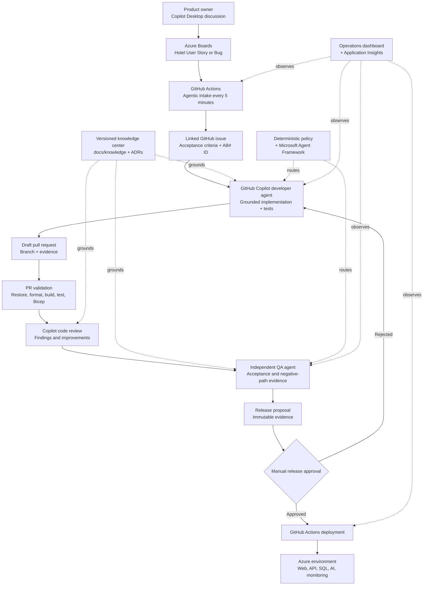

# Development Pipeline

This folder documents how the Hotel Booking system is developed, validated, observed, and deployed. Azure Boards provides product-work visibility, GitHub is the code and delivery system, GitHub Copilot agents perform bounded software work, and Azure hosts the development environment and Microsoft-native AI services.

## Development process



The intake, pull-request validation, Copilot review gate, independent QA evidence gate, development deployment, release proposal, manual production deployment, routing telemetry, and operations dashboard are implemented. Production release remains manual-only and cannot be triggered by a push or successful check.

## System ownership

| System | Responsibility |
|---|---|
| Azure Boards | Hotel User Stories and Bugs, acceptance criteria, product state, and visibility |
| GitHub | Source, issues, branches, pull requests, reviews, checks, and workflow history |
| GitHub Copilot | Product discussion, bounded implementation, review assistance, and QA assistance |
| GitHub Actions | Intake polling, quality gates, infrastructure deployment, and application deployment |
| Azure | Runtime hosting, data, AI services, secrets, search, identity, and observability |
| Repository knowledge center | Versioned product, domain, architecture, security, and delivery rules |

Azure Boards deliberately tracks hotel-product work only. Platform automation and AI-operations maintenance are managed in GitHub.

## Agentic intake

The `.github/workflows/agentic-intake.yml` workflow runs every five minutes and can also be dispatched manually.

1. GitHub Actions signs in to Azure through workload identity federation.
2. `scripts/Start-AgenticWork.ps1` obtains an Azure DevOps access token.
3. It queries `sample-project` for New User Stories and Bugs without the `github-synced` tag.
4. It creates a linked GitHub issue containing the requirement and agent operating contract.
5. It assigns `copilot-swe-agent` with the `hotel-developer` custom-agent profile.
6. It moves the Azure Boards item to Active, adds `github-synced`, and records the GitHub link.

The tag and work-item revision test make dispatch idempotent and protect against concurrent updates.

## Agent roles and coordination

### Product owner

The product owner uses GitHub Copilot Desktop to refine a hotel requirement before creating or accepting the Azure Boards item. The work item is authoritative for scope and acceptance criteria.

### Developer agent

`.github/agents/hotel-developer.agent.md` instructs the implementation agent to:

- read `AGENTS.md`, the work item, and relevant canonical knowledge;
- implement one complete vertical slice;
- add validation, error behavior, accessibility, and focused tests;
- preserve architecture, telemetry, and security controls;
- update canonical knowledge when behavior changes;
- open a pull request containing the Azure Boards reference and evidence.

### QA agent

`.github/agents/hotel-qa.agent.md` defines an independent evidence role. It does not accept the developer's claims without proof and reports each acceptance criterion as passed, failed, or unverified. Reservation changes require negative-path and concurrency coverage.

GitHub currently exposes no supported pull-request check API that dispatches this repository custom agent. `.github/workflows/qa-evidence.yml` therefore does not claim to run `hotel-qa`. It applies the contract independently after validation and review, reruns build and tests, compiles Bicep, validates pull-request acceptance and negative-path evidence, and uploads `qa-result.json`, `qa-result.md`, and TRX files. The JSON records the custom-agent execution as `not-run`. Agent judgment remains a separate manual invocation.

### Parallel work

The coordinator gives each agent a bounded objective, owned files or vertical slice, dependencies, interface contracts, evidence requirements, and knowledge revision. Parallel agents do not edit the same files unless work is explicitly serialized.

## Knowledge and hallucination controls

`AGENTS.md` is the mandatory operating contract. Canonical context is versioned under `docs/knowledge/`, while architectural decisions are recorded under `docs/adr/`.

The grounding protocol requires agents to:

- record the Git commit used as the knowledge revision;
- cite repository-relative sources for material claims;
- distinguish sourced facts, derived conclusions, and assumptions;
- stop and request evidence when sources conflict or do not answer the question;
- never invent requirements, API behavior, test results, deployment state, or work-item state;
- update knowledge in the same pull request as a behavior or architecture change.

Azure AI Search is provisioned for revisioned knowledge retrieval. Foundry evaluation and Azure AI Content Safety are the designated quality and safety controls for groundedness, task adherence, retrieval quality, and prompt-attack signals. Automated evaluation and content-safety gates still need to be wired into the delivery workflow. These signals never grant authorization.

## Microsoft-native routing

Routing is implemented in `src/Infrastructure/MicrosoftAgentRouter.cs`.

1. Deterministic C# policy validates required metadata and the live worker menu.
2. Incomplete evidence, high or critical risk, and irreversible actions route directly to `human_review`.
3. A single safe eligible worker is selected without a model call.
4. Multiple safe workers are sent to Microsoft Agent Framework as a bounded structured-output decision.
5. Azure OpenAI receives only task category, required capability, risk, evidence state, and worker IDs.
6. The response must name a live worker and meet the confidence threshold.
7. Invalid output, low confidence, missing configuration, model-service failure, or elevated risk routes to `human_review`.

The router does not send source code, prompts, secrets, guest data, work-item bodies, or retrieved document bodies. It cannot grant permissions or approve irreversible actions.

The development deployment uses `gpt-4.1-mini` in Sweden Central. The API in West Europe authenticates with its App Service managed identity and the Cognitive Services OpenAI User role; local model keys are disabled.

## AI operations and observability

The API accepts typed operations events and broadcasts them through SignalR. The `/operations` dashboard shows recent and live:

- routing decisions and confidence;
- policy or model identifier;
- selected and effective worker;
- agent and tool activity;
- evidence checks and completion state;
- failures and latency;
- human approval checkpoints;
- work-item correlation and knowledge revision.

Application Insights and Log Analytics provide runtime telemetry. Event contracts intentionally exclude prompts, source code, credentials, tokens, guest personal data, and tool-output bodies. Correlation IDs are operational identifiers rather than user identifiers.

## Pull-request validation

`.github/workflows/pr-validation.yml` runs for every pull request and every push to `main`:

1. Restore NuGet packages in locked mode.
2. Verify formatting without changing files.
3. Build the complete .NET solution.
4. Run unit and integration tests and upload TRX results.
5. Compile the subscription-scope Bicep entry point.

No proof means no completion. A change is not ready to merge without acceptance evidence, required output locations, test results, review status, knowledge updates, citations, unresolved gaps, and security or deployment impact.

## Copilot review gate

`.github/workflows/hotel-code-review.yml` runs in `pull_request_target` only for non-draft `main` pull requests that change hotel application, test, infrastructure, delivery, agent, or workflow paths. It never checks out or executes pull-request code with the privileged review-request token.

The workflow requests `copilot-pull-request-reviewer[bot]` through the supported GitHub REST review-request endpoint using `COPILOT_AGENT_TOKEN`, then uses the scoped `GITHUB_TOKEN` for read and pull-request metadata writes. It waits for a review tied to the current head commit. Unresolved High findings and findings without a machine-readable severity fail the check, add `development-required`, and return the pull request to development. Resolved threads clear the block on the next run. GitHub exposes severity labels in comment bodies but no confidence score; the workflow does not invent one.

Repository settings should require `PR validation / validate`, `Hotel code review / Copilot findings gate`, and `QA evidence / Independent QA evidence gate` before merge. The branch-protection and repository-rulesets APIs currently return HTTP 403 (`Upgrade to GitHub Pro or make this repository public`) for this private repository, so these checks cannot be server-enforced on the current plan. They remain fail-closed workflow evidence, and a human must not merge around a failing or missing result. Copilot code review must be enabled for the repository, and `COPILOT_AGENT_TOKEN` must be authorized to request Copilot reviews.

## Release proposal and production

A successful `QA evidence` run for `main` triggers `.github/workflows/release-proposal.yml`. It publishes API and web packages once, records the exact source commit and QA run, creates SHA-256 checksums, and uploads `release-<commit>` for 90 days. This is evidence, not deployment.

Production uses `.github/workflows/deploy-production.yml` and can run only through `workflow_dispatch`. The operator supplies the release workflow run ID, its full commit SHA, and the exact text `DEPLOY-PRODUCTION`. The workflow verifies that the run is a successful `Release proposal` run from `main`, confirms the commit is in current `main` history, downloads only that run's named artifact, verifies checksums, revalidates the referenced successful QA run and PR validation check for the same commit, and promotes without rebuilding. It does not trust unavailable branch protection. Deployment uses `infra/production.parameters.json` and the separate `agentic-hotelbookingprod` resource group. The existing development deployment remains unchanged.

The `production` GitHub Environment exists and is restricted to `main`. GitHub returned HTTP 422 when required reviewers and a wait timer were configured because those protection rules are unavailable for this private repository on its current billing plan. Until the plan supports those controls, typed confirmation, immutable source checks, manual dispatch, branch restriction, and repository write access are the implemented human controls. A repository administrator must configure environment OIDC values and deployment secrets before the first release. No production deployment was performed while implementing this pipeline.

## Development deployment

`.github/workflows/deploy-development.yml` runs after relevant changes reach `main` or through manual dispatch:

1. Authenticate to Azure with GitHub OIDC.
2. Deploy Bicep to `agentic-hotelbookingdev`.
3. Publish and deploy the ASP.NET Core API to App Service.
4. Publish the Blazor WebAssembly client.
5. Inject the deployed API endpoint into the web configuration.
6. Deploy the client to Azure Static Web Apps.

The development topology is:

| Component | Azure service | Region |
|---|---|---|
| Booking web application | Static Web Apps | Azure-managed |
| Booking and operations API | App Service | West Europe |
| Catalog and reservations | Azure SQL | West Europe |
| Secrets | Key Vault | West Europe |
| Routing model | Azure AI Services / Azure OpenAI | Sweden Central |
| Knowledge retrieval | Azure AI Search | West Europe |
| Application telemetry | Application Insights + Log Analytics | West Europe |

Infrastructure is declared in `infra/`. Production must use a separate resource group and a protected GitHub Environment with required human reviewers.

## Identity, permissions, and secrets

- GitHub Actions uses OpenID Connect instead of a stored Azure client secret.
- App Service uses a system-assigned managed identity.
- Azure OpenAI local authentication is disabled.
- App Service has the least-privilege Cognitive Services OpenAI User role.
- The SQL connection is exposed to App Service through a Key Vault reference.
- GitHub Environment secrets hold deployment-only values.
- CORS allows only configured web origins.
- Production, spending, permanent deletion, secrets, external publication, and other irreversible actions require human approval.

## Local development

Run the API and web application in separate PowerShell terminals:

```powershell
dotnet run --project src\Api\AgenticHotelBooking.Api.csproj
dotnet run --project src\Web\AgenticHotelBooking.Web.csproj
```

Local endpoints:

- Booking application: <http://localhost:5051>
- Operations dashboard: <http://localhost:5051/operations>
- API health: <http://localhost:5224/health>

Model-assisted routing is disabled locally by default; deterministic policy remains active. To use an Azure model, configure:

```json
{
  "MicrosoftRouting": {
    "ModelEnabled": true,
    "MinimumConfidence": 0.8,
    "Deployment": "gpt-4.1-mini",
    "Endpoint": "https://<resource>.openai.azure.com/"
  }
}
```

`DefaultAzureCredential` uses the developer's Azure CLI or IDE identity locally.

## Required validation commands

```powershell
dotnet restore --locked-mode
dotnet format --verify-no-changes --no-restore
dotnet build --no-restore
dotnet test --no-build
dotnet list package --vulnerable --include-transitive
az bicep build --file infra\main.bicep
```

## Related files

| Path | Purpose |
|---|---|
| `AGENTS.md` | Mandatory grounding, coordination, evidence, and approval contract |
| `docs/knowledge/` | Canonical product, domain, architecture, security, and delivery context |
| `docs/adr/` | Architectural decision history |
| `.github/agents/` | Developer and QA custom-agent profiles |
| `.github/workflows/agentic-intake.yml` | Azure Boards to Copilot dispatch |
| `.github/workflows/pr-validation.yml` | Pull-request quality gates |
| `.github/workflows/hotel-code-review.yml` | Copilot review request and blocking-findings gate |
| `.github/workflows/qa-evidence.yml` | Independent acceptance and negative-path evidence gate |
| `.github/workflows/release-proposal.yml` | Immutable release packages, checksums, and proposal |
| `.github/workflows/deploy-development.yml` | Development infrastructure and application deployment |
| `.github/workflows/deploy-production.yml` | Manual-only verified production promotion |
| `scripts/Start-AgenticWork.ps1` | Idempotent work-item intake implementation |
| `infra/` | Azure Bicep definitions |
| `src/Infrastructure/MicrosoftAgentRouter.cs` | Deterministic and model-assisted routing |
| `src/Web/Pages/Operations.razor` | Real-time AI operations dashboard |
